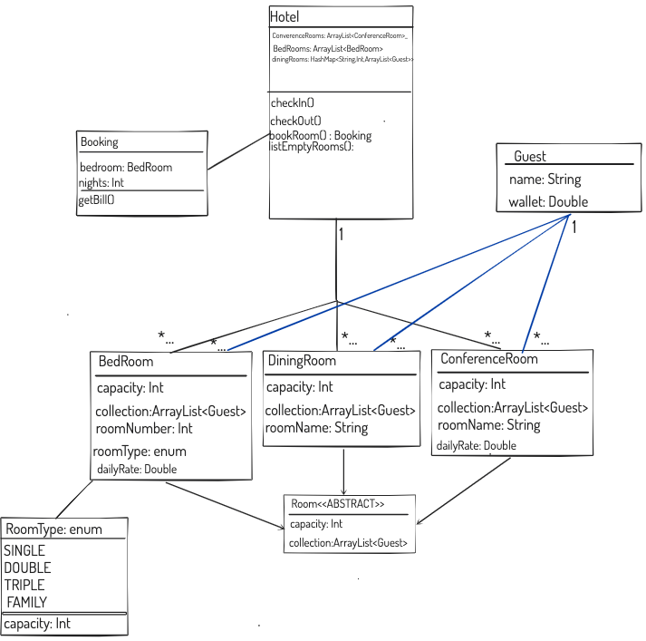
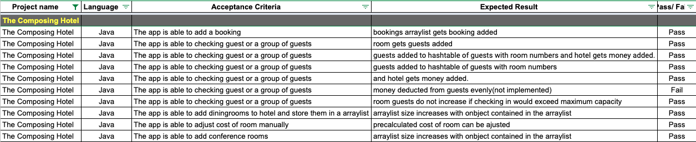

#The Composing Towers
A hotel booking App:
- written in Java.
- Interface: Scanner.
#### Purpose - Practice using:
- TDD
- enums
- abstract classes and inheritance
- encapsulation
- HashMaps
- logic and problem solving
- method overloading
- packages

#### Requirements:
- Java compiler & Java

## Classes tested:
- [x] Guest.java via GuestTest.java, test count: 4
- [x] BedRoom.java via BedRoomTest.java, test count: 7
- [x] ConferenceRoom.java via ConferenceRoomTest.java, test count: 7
- [x] Booking.java  via BookingTest,java, test count: 6
- [x] Hotel.java  via HotelTest,java, test count: 9
- [x] Randomised.java  via RandomiserTest,java, test count: 3

### MVP
- [x] Create a Guest class to represent a visitor to the hotel, they'll at least need a name, you can add more properties later if and when they become necessary
- [x] Create a RoomType enum of bedroom types (e.g. Single/Double) and capacity
- [x] Create a Room abstract class with a capacity and collection of Guests
- [x] Create 2 different types of rooms that inherit from Room:
- [x] Bedrooms will additionally have a room number and RoomType
- [x] ConferenceRooms will additionally have a name and any other properties you wish.
- [x] Create a Hotel class, which has a collection of Bedrooms and a collection of ConferenceRooms.
- [x] The Hotel will be able check guests in/out of rooms.

### Extensions
- [x] Create a Booking class which contains a Bedroom with a number of nights booked.
- [x] Create a bookRoom method in your Hotel. This should book a given Bedroom for a number of nights. This should return a new Booking object.
- [x] Add a nightly rate to your Bedrooms and write a method to return the total bill for the Booking.
- [x] Add a DiningRoom class with a name, capacity, and collection of guests
- [x] Hotel will have a HashMap based collection of DiningRooms.

### Advanced Extensions
- [x] Add functionality to the Hotel, so it can return a collection of only the vacant Bedrooms.
- [ ] (different, see below) Update the check-in process so that Hotel will only be able to check guests into empty Bedrooms.
- [x] Checking only to rooms that still have capacity.        
### Personal Extensions  (hopefully have time for these)
- [x] Hotel has a bank guests have wallets

## Planning practice:
- [x] Class diagram
- [x] Acceptance Criteria

## Images:
##### Class diagram: 
 
##### Acceptance Criteria: 
 

